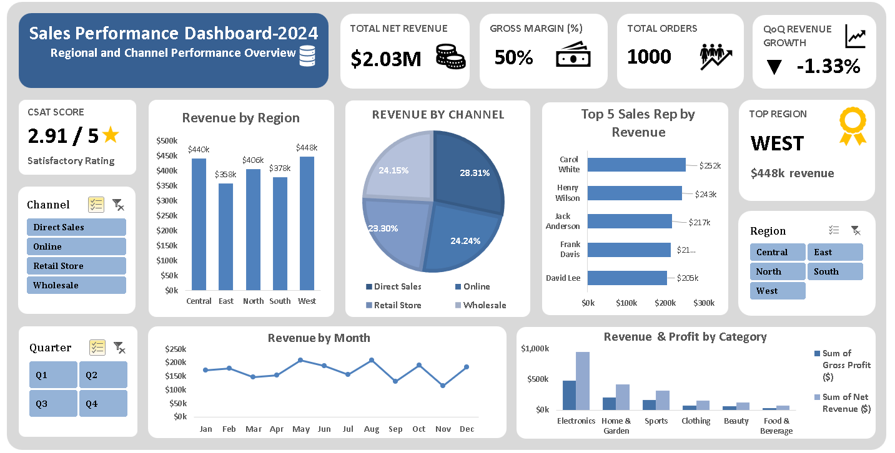
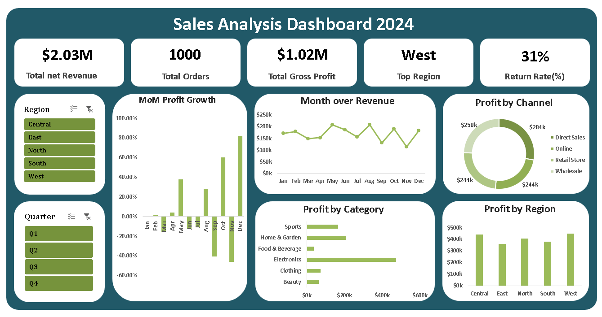
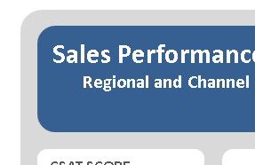

# Excel Sales Performance Dashboard 2024

## Overview
Developed an interactive Excel dashboard to analyze sales performance across regions, channels, and product categories for the year 2024. The dashboard enables dynamic filtering and provides insights into revenue trends, sales performance, and customer satisfaction.

The solution helps identify key revenue drivers, top-performing sales representatives, and seasonal patterns to support data-driven decision-making.

---

## Dashboard Preview

---

## Key Features
- KPI Cards: Total Net Revenue, Gross Margin, Total Orders, and QoQ Growth  
- Revenue breakdown by Region, Channel, and Product Category  
- Top 5 Sales Representatives by Revenue  
- Month-over-Month Revenue Trend Analysis  
- Customer Satisfaction (CSAT) Score Tracking  
- Interactive Slicers for Region, Channel, and Quarter filtering  

---

## Summary Sheets
Detailed supporting tables for deeper analysis:

---

## Tools & Techniques
- Microsoft Excel  
- Pivot Tables & Pivot Charts  
- Slicers for dynamic filtering  
- Conditional Formatting for visual insights  
- Dashboard layout design using PowerPoint  

---

## Project Files
| File | Description |
|------|------------|
| Sales_Performance_Dashboard_2024.xlsx | Interactive dashboard and analysis |

---

## How to Use
1. Download the Excel file  
2. Enable editing if prompted  
3. Use slicers to filter data by Region, Channel, or Quarter  
4. Analyze KPIs and charts for insights  
